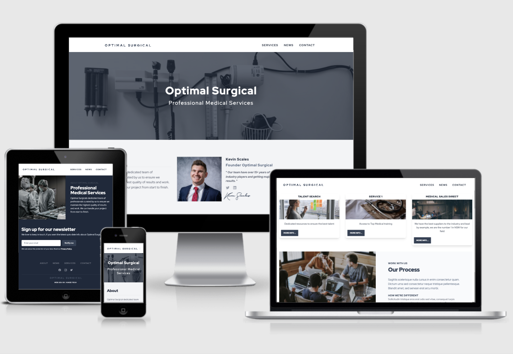

## **Optimal Surgical - Medical Services**

Optimal Surgical is currently deployed and can be visited directly at **[Optimal Surgical ](https://optimalsurgical.com.au/)**

---

## 📓 **About the project:**

**Optimal Surgical** - Professional Medical Services founded in Australia.

## 💻️ **Technologies Used:**

---

- **[NEXTJS](https://nextjs.org/):** -
  hybrid static & server rendering, TypeScript support, smart bundling, route pre-fetching, and more.
- **[REACT](https://reactjs.org/docs/create-a-new-react-app.html):** -
  A JavaScript library for building user interfaces

- **[HTML](https://developer.mozilla.org/en-US/docs/Web/HTML):** -
  Is the main language used in this project which allowed me to correctly structure the website, whereby using best practices to use semantic tags where appropriate.

- **[CSS](https://developer.mozilla.org/en-US/docs/Web/CSS):** - Was used via an external stylesheet using best practices to style format and visually present the HTML.

- **[VERCEL](https://www.vercel.com/):** - Used in this project to deploy the live site to the web.

- **[SANITY]():** - CMS unified content platform that powers better digital experiences

- **[JAVASCRIPT](https://developer.mozilla.org/en-US/docs/Web/JavaScript):** - _As part of Bootstrap_ Javascript although I haven't programmed it, was included in the site as part of the Bootstrap framework so that some Bootstrap components such as the navigation toggler would work.

- **[TAILWIND](https://tailwind.com/):** - CSS utility class framework.

- **[GIT](https://git-scm.com/):** Git employed as version control

- **[GITHUB](https://github.com/):** - Github was used to host the repository for this project.

- **[SQUOOSH](https://squoosh.app/):** - I used Squoosh to reduce the image sizes

- **[PHOTOSHOP](https://www.adobe.com/uk/products/photoshop.html):** - For editing images associated with this project.

- **[BALSAMIQ](https://balsamiq.com/):** - Mac version to develop wireframes for this project.

- **[CHROME](https://www.google.com/intl/en_uk/chrome/):** - Not only did I use Chrome extensively for testing and bug fixing but I used the following extensions :

- **[PESTICIDE](https://www.google.com):** - This extension inserts (with auto-reload) the Pesticide CSS into the current page, outlining each element. - Giving a good visual representation of containers rows etc, as I was using a material design from MDBootstrap I was inserting containers into containers in points to get the desired layout and style, this extension allowed me to view the layout correctly.

- **[RESPONSIVE VIEWER](https://chrome.google.com/webstore/detail/responsive-viewer/inmopeiepgfljkpkidclfgbgbmfcennb):** - A Chrome extension to show multiple screens in one view. the extension will help front-end developers to test multiple screens while developing responsive websites/applications.

- **[AM I RESPONSIVE](http://ami.responsivedesign.is/):** - Used to generate the header image displayed at top of Readme.MD file depicting 4 screen displays.

- **[FAVICON](https://favicon.io/):** - Used to generate the favicon

- **[CSS BEAUTIFIER](https://www.freeformatter.com/css-beautifier.html):** - Formats a CSS files with the chosen indentation level for optimal readability. Supports 4 indentation levels: 2 spaces, 3 spaces, 4 spaces and tabs.

- **[PRETTIER](https://prettier.io/):** - Prettier is an opinionated code formatter for HTML CSS JavaScript etc
